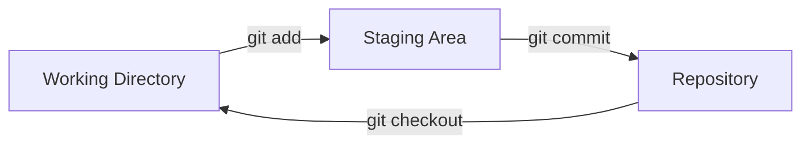

## Step 2: 最初のリポジトリを作る

サンプルプロジェクトを確認し、Git に自分が誰かを伝えました。次はゲームをバージョン管理に入れましょう。

### 📖 理論：Git のワークフロー

Git のワークフローには、主に 3 つの領域があります。

- **作業ディレクトリ（Working Directory）**: 変更を加えているプロジェクトのファイルです。
- **ステージング領域（Staging Area / Index）**: 履歴に保存したい変更をまとめるための準備場所です。
- **リポジトリ（Repository）**: プロジェクトの開発履歴を恒久的に記録する場所です。



### よく使う Git コマンド

Git には多くの操作がありますが、ローカルのプロジェクトでよく使うのは次のいくつかです。

- `git init` — バージョン管理を有効にするため、新しいリポジトリを開始します。
- `git add` — 関連する変更をステージング領域にまとめ、履歴への「コミット」に備えます。
- `git commit` — ステージング領域の変更をプロジェクトの履歴に保存（コミット）します。
  - コミットメッセージ — 履歴を整理された状態に保つための、変更の短い説明です。
- `git status` — 作業ディレクトリとステージング領域の現在の状態を表示します。
- `git checkout` — 作業ディレクトリをリポジトリ履歴の別のバージョンに切り替えます。

> [!TIP]
> コミットメッセージを軽く見ないでください。明確で簡潔、具体的でありきたりでないメッセージは、プロジェクトの履歴をずっと理解しやすくします（将来のバグ探しにも役立ちます）。

### ⌨️ やること 1：プロジェクトのリポジトリを初期化する（CLI）

ゲームにバージョン管理を追加し、現在のバージョンをコミットしましょう。

1. ターミナルで、プロジェクトのディレクトリに移動します。

   ```bash
   cd /workspaces/stack-overflown
   ```

1. 新しい Git リポジトリを初期化します。

   ```bash
   git init
   ```

1. リポジトリの状態を確認します。"No commits yet" という表示と、`git add` を使うようにという案内が出ます。

   ```bash
   git status
   ```

   

1. ゲームのファイルをステージング領域に上げます。ロックされたコピーが作られ、リポジトリ履歴へのコミットに備えた状態になります。

   ```bash
   git add src/index.html
   git add src/index.js
   git add src/patterns.js
   git add src/style.css
   ```

   または

   ```bash
   git add src/*
   ```

1. もう一度リポジトリの状態を確認します。各ファイルが `new file` と表示されます。

   ```bash
   git status
   ```

   

1. 変更をリポジトリの履歴にコミットします。プロジェクトの履歴が始まりました。:octocat:

   ```bash
   git commit -m "Initial commit"
   ```

   

1. リポジトリの状態を確認します。"working tree clean" は、現在のコピーが履歴と完全に一致していることを意味します。

   ```bash
   git status
   ```

   

### ⌨️ やること 2：ファイルを編集する（VS Code）

コードエディターでもファイルを追加してみましょう。今回はゲームのドキュメントを作ります。

1. ファイルエクスプローラーで **New File...** アイコンをクリックし、次の名前で README ファイルを作ります。`./stack-overflown/` フォルダーの中に作ってください。

   ```txt
   README.md
   ```

   

1. ファイルを開き、次の内容を入力します。

   ```md
   # Stack Overflown

   Organize the falling blocks into the current debug pattern before the stack overflows! ⏳
   ```

1. 左のナビゲーションで **Source Control** タブを選びます。`README.md` が **Changes** の下に表示されます。

   

1. ファイルにマウスを合わせ、プラス記号 `+` のボタンを押して、ステージング領域に上げます。

   

1. コミットメッセージを入力し、**Commit** ボタンを押します。

   ```txt
   Start game documentation
   ```

   

1. 2 回目のコミットとして、`README.md` に次の内容も追加します。

   ```md
   ## How to Develop

   - `index.html` - the game container for playing
   - `index.js` - the primary game logic
   - `patterns.js` - the error patterns to match during gameplay
   - `style.css` - the game formatting and styling
   ```

1. 変更をステージングに上げ、次のメッセージでコミットします。

   ```txt
   Start developer docs
   ```

   

1. 新しいコミットがリポジトリに追加されたので、Mona が作業を確認しています。少し待って、コメントを見てください。進捗と次の Step が投稿されます。

<details>
<summary>うまくいかないとき 🤷</summary><br/>

- `git status` に間違ったファイルが出ている場合は、`git restore --staged <filename>` でステージングから外せます。

</details>
