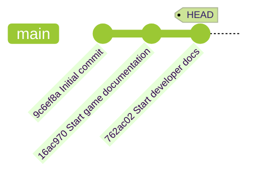

## Step 3: Git の履歴を見る

ゲームが Git で追跡されるようになりました。次は、どんな変更が、いつ、誰によって行われたかを調べる方法を学びます。

### 📖 理論：Git の履歴を理解する

Git はコミットによってプロジェクトの完全な履歴を保持します。各コミットには次の情報が含まれます。

- **一意のハッシュ ID**: 履歴の中で簡単に参照するための識別子です。
- **親コミット**: 1 つ前のコミットへの参照です。参照が連なりを作ります。
- **作成者情報**: 誰が変更したか。
- **タイムスタンプ**: いつ変更が適用されたか。
- **コミットメッセージ**: コミットに含まれる変更の説明。

さらに `HEAD` ポインターという特別なラベルがあり、プロジェクト履歴の中で今どこにいるかを示します。自分のプロジェクトは、おそらく次の図のような状態です。



### よく使う Git コマンド

履歴の見方は人によって好みが違い、コミュニティが多くの選択肢を作ってきました。
よく使うコマンドとオプションをいくつか挙げます。

- `git log` — プロジェクトの詳しい履歴を表示します。
  - `git log --oneline` — 1 コミットを 1 行で表示します（詳細は減ります）。
  - `git log --graph` — 図として表示します。枝分かれがあるときに便利です。
- `git checkout` — 履歴の別の地点へ移動します（作業ディレクトリのファイルが変わります）。

### ⌨️ やること 1：履歴を見る（CLI）

1. 詳しいコミット履歴を表示します。

   ```bash
   git log
   ```

   

1. 1 コミットを 1 行で表示します。

   ```bash
   git log --oneline
   ```

   

1. コミット履歴全体を図で表示します。

   ```bash
   git log --graph --oneline
   ```

   > 🪧 **注**: 履歴が長くなる後の Step で、図の表示はもっと面白くなります。

1. `Initial commit` の **Commit ID** をコピーします。長い形式でも短い形式でも動きます。

1. Commit ID を使って、以前のバージョンを取り出します。

   ```bash
   git checkout <commit id>
   ```

   <br/>

   🪧 `README.md` が消えたことに注目してください。

   

1. `main` の最新コミットに戻ります。`README.md` が戻ってきます。🧐

   ```bash
   git checkout main
   ```

   <br/>

   

### ⌨️ やること 2：履歴を見る（VS Code）

1. 左のナビゲーションで **Source Control** タブを開きます。

1. **Changes** の見出しを右クリックし、**Graph** のオプションを有効にします。

   

1. **Graph** パネルを見ます。最近のコミットが時系列で並んでいます。

   <br/>

1. コミット名をクリックすると、変更されたファイルの一覧が開きます。

   

1. Git の履歴を見終わったので、Mona が作業を確認しています。少し待って、コメントを見てください。進捗と次の Step が投稿されます。

<details>
<summary>うまくいかないとき 🤷</summary><br/>

- `git log --help` で、履歴表示に使えるオプションをすべて確認できます。

</details>
