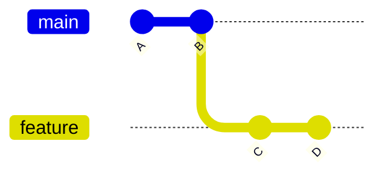
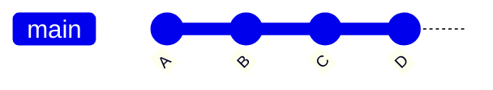
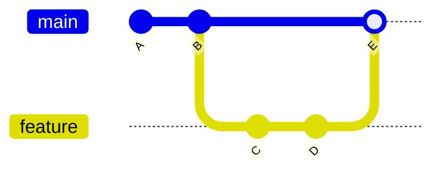
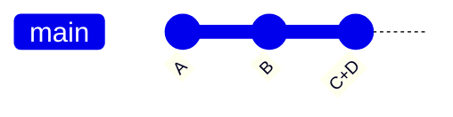

## Step 5: ブランチを扱う

ゲームが追跡されるようになり、動くバージョンに簡単に戻れることが分かりました。履歴にコミットする内容も正確に確認できるので、関係のないものが混ざる心配もありません。

すると、新しい疑問が出てきます。😱

「履歴が散らかるのをどう防ぐ？」

「作業途中の動かないバージョンが履歴に入るのをどう避ける？」

「複数の機能や修正を同時に進めたいときは？」

### 📖 理論：ブランチを理解する

Git のブランチは、特定のコミットを指す軽量なポインター（ラベルのようなもの）です。ブランチを使うと、元のバージョンに影響を与えずに派生したバージョンで作業できます。並行した機能開発や共同作業に向いています。

重要な考え方：

- **`main` ブランチ**: 通常は信頼できる動作版で、最初のブランチです（歴史的には `master` と呼ばれていました）。
- **フィーチャーブランチ**: 信頼できるバージョンに影響を与えずに開発できる、安全で隔離された場所です。
- **マージ**: 異なるブランチの変更を 1 つにまとめることです。

### ブランチはどうやって合流させるのか

コミットを整理する方法は複数あります。たいていは、整理の仕方・見通しのよさ・追跡しやすさのスタイルの違いによるものです。代表的なものを紹介します。

**Fast-forward merge**: 子ブランチの新しいコミットを親ブランチへ移動します。

<div align="center">

**Before:** Original



**After:** Fast Forward Merge



</div>

**Merge commit**: 変更を 1 つの新しいコミットとして親ブランチに適用します。追跡できるよう、子ブランチはネットワーク図に残します。

<div align="center">

**Before:** Original


**After:** Merge Commit



</div>

**Squash merge**: 一方のブランチのコミットをまとめて、もう一方のブランチに 1 つの新しいコミットとして作ります。

<div align="center">

**Before:** Original


**After:** Squash Commit



</div>

### よく使う Git コマンド

- `git branch my-new-feature` — 現在のブランチからブランチを作ります。
- `git checkout my-new-feature` — 作業ディレクトリをリポジトリ履歴の別のバージョンに切り替えます。
- `git merge` — 一方のブランチのコミットをもう一方のブランチに適用します（既定は fast forward merge）。

<!-- > [!TIP]
> You can perform a simple "undo" of the last commit with `git reset --soft HEAD~1`. For VS Code, use the Command Palette and search for `Undo Last Commit`. -->

> [!TIP]
> Git 2.23 でブランチ管理を簡単にする `git switch` コマンドが導入されました。今後は `git switch` を見かけることが増えるでしょう。

<!-- Since Git 2.23 -->
<!-- `git switch --create <branch name>` -->
<!-- `git switch branch-name` -->

### ⌨️ やること 1：ブランチにコミットする（CLI）

ブランチを作り、変更をコミットする練習をしましょう。

1. 始める前に、今の履歴を見てみます。完全に一直線（まだ枝分かれなし）です。

   ```bash
   git log --all --graph --oneline
   ```

   

1. 新しいブランチを作り、切り替えます。

   ```bash
   git branch fix-incomplete-high-score
   git checkout fix-incomplete-high-score
   ```

1. 使えるブランチの一覧を表示します。

   ```bash
   git branch --list
   ```

   

1. high score 機能を直すため、`index.js` を開きます。

1. `line 41` に high score 用の変数を挿入し、コミットします。

   ```js
   let highScore = 0;
   ```

   ```bash
   git add src/index.js
   git commit -m "Add new variable for tracking high score"
   ```

1. `line 61` に、ローカルストレージからスコアを読み込むコードを挿入し、コミットします。

   ```js
   // Load high score from localStorage
   highScore = parseInt(localStorage.getItem("stackOverflownHighScore")) || 0;
   document.getElementById("high-score").textContent = highScore;
   ```

   ```bash
   git add src/index.js
   git commit -m "Add loading of stored high score"
   ```

1. `line 313` の `updateScore` 関数を次の内容に置き換えて最高スコアを記録できるようにし、コミットします。

   ```js
   function updateScore() {
     document.getElementById("score").textContent = score;

     // Update high score if current score exceeds it
     if (score > highScore) {
       highScore = score;
       document.getElementById("high-score").textContent = highScore;
       localStorage.setItem("stackOverflownHighScore", highScore);
     }
   }
   ```

   ```bash
   git add src/index.js
   git commit -m "Add logic to keep track of highest score"
   ```

1. もう一度履歴の図を見ます。フィーチャーブランチが `main` より 3 コミット進んでいること、そしてフィーチャーブランチに `HEAD` が付いていて現在地が分かることに注目します。

   ```bash
   git log --all --graph --oneline
   ```

   

1. `main` ブランチに戻ります。

   ```bash
   git checkout main
   ```

1. 新しい機能をマージします。

   > 🪧 **注**: 学習のため、ブランチが履歴に残る「fast forward しない」オプションを使います。図が見て分かりやすくなります。

   ```bash
   git merge --no-ff fix-incomplete-high-score -m "Fix high score tracker"
   ```

   

1. もう一度履歴の図を見ます。並行していたブランチがマージされたことが分かります。

   ```bash
   git log --all --graph --oneline
   ```

   

1. マージ済みで不要になったフィーチャーブランチのポインター（ラベル）を削除します。

   ```bash
   git branch --delete fix-incomplete-high-score
   ```

   > 🪧 **注**: 削除するのはブランチの中身ではなく、参照に使っていた名前だけです。

### ⌨️ やること 2：ブランチにコミットする（VS Code）

1. 左のナビゲーションで **Source Control** タブを開きます。**Graph** パネルが表示されたままであることを確認します（Step 3 で有効にしたもの）。変更を加えるたびに更新される様子を見ていきます。

1. 画面下のステータスバー左側にあるブランチ名 `main` をクリックします。メニューが表示されます。

   <br/>

1. **Create new branch...** を選び、次の名前を使います。

   

   ```txt
   add-level-counter
   ```

   

1. `index.html` を開きます。`line 21` に現在のレベルを表示する要素を挿入し、変更をコミットします。

   ```diff
   <h3>Level</h3>
   <div class="score" id="level">1</div>
   ```

   コミットメッセージ

   ```bash
   Add element to display current level
   ```

1. レベルカウンターを追加するため、`index.js` を開きます。

1. `line 42` に、レベルを記録する変数を 2 つ追加し、変更をコミットします。

   ```js
   let level = 1;
   let patternsCleared = 0;
   ```

   コミットメッセージ

   ```bash
   Add variables for level and clear counter
   ```

1. `line 273` の `checkPatternMatch` メソッドを次の内容に置き換え、変更をコミットします。

   ```js
   function checkPatternMatch() {
     for (let startRow = 0; startRow <= ROWS - PATTERN_SIZE; startRow++) {
       for (let startCol = 0; startCol <= COLS - PATTERN_SIZE; startCol++) {
         if (matchesPattern(startRow, startCol)) {
           clearPattern(startRow, startCol);
           score += 100;
           patternsCleared++;
           if (patternsCleared % 5 === 0) {
             level++;
             dropInterval = Math.max(200, 1000 - (level - 1) * 100);
             document.getElementById("level").textContent = level;
           }
           updateScore();
           setNewTargetPattern();
           return;
         }
       }
     }
   }
   ```

   コミットメッセージ

   ```bash
   Add logic to calculate level
   ```

1. **Graph** パネルに履歴全体（新しいコミット、前のブランチ、最初のコミット）が表示されていることに注目します。

   

1. マージの準備として、もう一度ブランチ名をクリックし、`main` ブランチを選びます。

   <br/>

   

1. 三点メニュー（`...`）→ `Branch` → `Merge...` を選びます。通常の **Fast Forward** 形式でマージされたことに注目します。

   <br/>

   <br/>

   

1. 三点メニュー（`...`）→ `Branch` → `Delete Branch...` を選びます。

   <br/>

   

1. 両方のブランチをマージしたので、Mona が作業を確認しています。少し待って、コメントを見てください。進捗と次の Step が投稿されます。

<details>
<summary>うまくいかないとき 🤷</summary><br/>

- ブランチ名を打ち間違えた場合は、`git branch --move old-name new-name` で変更できます。

</details>
